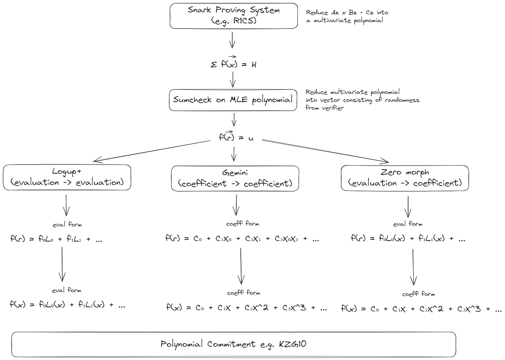
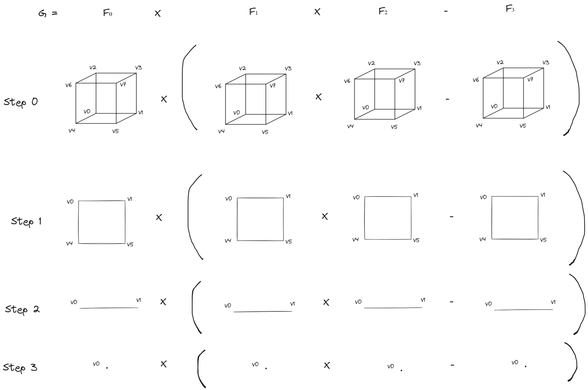

# Hello, Hypercube!

### Motivation

This is a project as part of ZK Hack Istanbul 2023. zk-SNARKS has always been a black box to most ZK developers, and our motivation is to deconstruct the black box into its base level primitives, showcasing the various techniques that can be used to transform a much complex constraints problem into simpler univariate polynomials that are much easier and efficient to dealt with.

The goal is to implement cryptographic primitives to reduce sumcheck-based zk-SNARKS proving system into a univariate polynomial eventually. We call it "Hello, Hypercube!" because a multilinear polynomial can be represented as points on a Boolean hypercube and reduced through evaluations on it partial sum (using sumcheck).

Such reduction can be used in:
- Sumcheck-based zk-SNARKS
- Nova-like folding schemes
- Lasso/Jolt zkVM systems
- GKR-based protocols

### Overview



The above diagram shows the outline of this project. Starting from the top level, we have a ZK proving system (a simplified version of Spartan is implemented here). The proving system can be represented as a multilinear polynomial. We can think of the multilinear polynomial as a Boolean hypercube. For example, if the polynomial is of form $`f(x_1, x_2, x_3)`$, then the hypercube is of dimension 3. We can think of f as following:
```
f(0, 0, 0) = v_0
f(0, 0, 1) = v_1
f(0, 1, 0) = v_2
f(0, 1, 1) = v_3
f(1, 0, 0) = v_4
f(1, 0, 1) = v_5
f(1, 1, 0) = v_6
f(1, 1, 1) = v_7
```
where $`v_i`$ is the value of the polynomial at the point $`(x_1, x_2, x_3)`$ = $`(i_1, i_2, i_3)`$. Point $`v_i`$ is each a vertex of the hypercube. We can then evaluate over the hypercube to get the partial sums from the sumcheck protocol. The purpose of evaluating the polynomial on a Boolean hypercube is that multilinear sumcheck is efficient for bitwise operations.

Thinking of zk-SNARKS construction as hypercubes is very intuitive. For example, R1CS follows the general form of $`A\vec{z}\circ B\vec{z} = C\vec{z}`$, which we can decompose it into multiple polynomials as shown in the diagram below. Each polynomial is a hypercube, and to evalutate their relationships we just need to evaluate by traversing the vertices of the hypercubes.



After the sumcheck protocol, we have reduced the polynomial to a simpler form where it is a polynomial dependent on the verifier's randomness during sumcheck. This is represented as f(r) and is still a multilinear polynomial, though a much smaller one. We want to further reduce this to a univariate polynomial. Three ways that have been mentioned in literature are [LogUp+](https://eprint.iacr.org/2023/1284.pdf), [Gemini](https://eprint.iacr.org/2022/420.pdf) and [ZeroMorph](https://eprint.iacr.org/2023/917.pdf). They each use different techniques, which are:
1. LogUp+: reduction of multivariate polynomial in evaluation form to univariate in evaluation form
2. Gemini: reduction of multivariate polynomial in coefficient form to univariate in coefficient form
3. ZeroMorph: reduction of multivariate polynomial in evaluation form to univariate in coefficient form

It's much easier to deal with univariate polynomial using commitment schemes such as KZG10. Especially when a degree-N polynomial has really large degrees (i.e. N), the evaluation proofs of such polynomials become prohibitively expensive, which motivates the entire project.

### Running the code

```
cd univarization
cargo test
```

### Code Organization

The main files showcasing our work are as follows (in the `univarization/src` folder):
- `mle.rs`: representing polynomials using multilinear extension (MLE)
- `unipoly.rs`: representing univariate polynomials
- `sumcheck.rs`: sumcheck protocol on multilinear polynomials
- `gemini.rs`: implementation of the Gemini univarization technique as mentioned above
- `ph.rs`: implementation of the LogUp+ technique as mentioned above
- `fftunipoly.rs`: FFT functions needed on polynomial commitments
- `snark.rs`: implementation of a Spartan like proving system

We use ark_bn254, ark_std, ark_ff in our implementations.

| File           | Blank | Comment | Code |
| -------------- | ----- | ------- | ---- |
| fftunipoly.rs  | 142   | 70      | 517  |
| snark.rs       | 78    | 36      | 325  |
| sumcheck.rs    | 97    | 54      | 247  |
| unipoly.rs     | 112   | 302     | 224  |
| mle.rs         | 55    | 21      | 219  |
| lib.rs         | 50    | 12      | 181  |
| kzg10.rs       | 55    | 8       | 169  |
| gemini.rs      | 36    | 8       | 140  |
| ph23.rs        | 38    | 15      | 140  |
| unisumcheck.rs | 36    | 7       | 130  |
| transcript.rs  | 20    | 2       | 98   |
| **SUM**        | 719   | 535     | 2390 |

### Future Work

- ZeroMorph is not implemented yet due to time constraint. 
- Some of the polynomial constructions are not fully optimized yet. 
- We look to benchmark the three approaches in the future. 
- Adding zero knowledge construction will also be an interesting direction.

### Credits

Our work is based on the following papers and libraries:
- [LogUp+](https://eprint.iacr.org/2023/1284.pdf)
- [Gemini](https://eprint.iacr.org/2022/420.pdf)
- [ZeroMorph](https://eprint.iacr.org/2023/917.pdf)
- [Arkworks](https://github.com/arkworks-rs)
